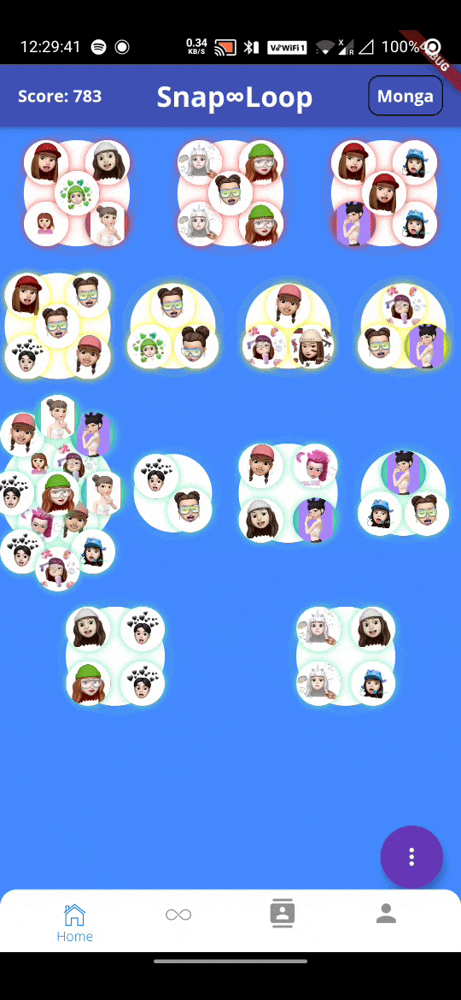
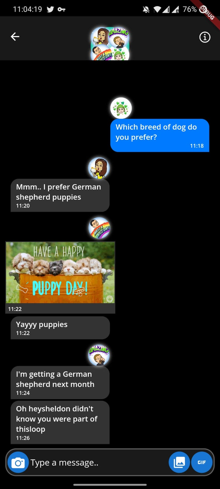

# SnapLoop

SnapLoop creates a loop of friends where the creator starts a thread and sends it to any of their mutual friends anonymously. The thread keeps on continuing on the same topic until it is looped back to the creator. Therefore it creates a loop of friends who gain some game points and reveal their identity once the loop is finished, connecting like-minded people through this social media platform.

The app provides an option to start a Loop or forward an already existing message that was created by another person. A user can only start a limited number of loops per day and forward unlimited conversations. Whenever a user starts a loop, they can start it by either typing a message or just by using a GIF, mp3, mp4 or any other type of multimedia format (adding multi-media support is still a work in progress). The app only allows you to forward the message to any of your contacts and the message will be anonymous, and none of your friends will know where it came from except that they will know that it came from either one of their contacts. The loop will continue until it reaches back to the person who originally started it. Once the loop is completed, all the members will be notified and they will receive a score.

All modern social media platforms work on a self satisfaction feedback loop which consists of people posting pictures, getting likes, and their need for acceptance in the society is fulfilled. Snaploop aims to break this “lingo” and innovate this revolutionary social media platform where people genuinely want to connect people without the aspect of satisfying their social status constantly.

All social media apps portray a similar concept to each other but SnapLoop aims to introduce diversity. Comparison with other lives has been made easy by social media. People become unhappy with their current circumstances, leading to problems with self-esteem. To overcome that I want to design a product, a game that is comfortable for everyone to play.

Columbus was a pioneer in exploring, just like Einstein was in the field of physics. Snaploop will be the pioneers of an adventurous social media platform. Young adults thrive for change. They get bored with the same old concept of posting pictures and stories for getting comments and likes. With our product they can get social acceptance but at the same time have a bit of fun.

Our venture helps people socialize and connect to other people in a fun and interesting way. SnapLoop was inspired by the idea of breaking a social media stereotype which has been existing in society for a very long time. Unlike the current era of social media which aims to make benefit out of people’s social status satisfaction, SnapLoop desires to make the social media a much more engaging platform.

# Development (Work in Progress)

The app is currently being developed in Flutter and the server is being developed in Node.js.
Feel free to contact me to learn more about it or if you want to contribute in the project!

## Exploring new technologies

During the summer of 2020, I started learning different technologies to bring my ideas to life and create a product that can be used by people around the world. I have researched a lot before beginning the development of this app in flutter. I knew that I had limited time and resources, so it would be hard for me to handle two different code base (Android and iOS) for the same application along with working on the server. So I started looking for a cross platform solution.

I started looking into different solutions like React Native, Ionic, and Flutter. I first started learning react.js and then learned the basics of react-native, which to be honest was hard coming from java background even though I knew basics of Javascript. After some time I realized that there was no way around and I had to learn advanced javascript as I will be developing my server in Node.js, so I started learning some advance concepts and took an online course on Udemy for learning Node.js. Some of the cool apps like Instagram that I use on a daily basis are created in React Native, and I was convinced to create my application in React Native. As I started laying out the plan, I figured there were too many complex features, which were difficult to implement and I might have to write native code for both Android and iOS for some of the native features like camera.

I was looking for alternatives and I started learning flutter, I watched a few videos on youtube discussing how flutter is a great cross application development framework. Flutter was an emerging technology and I thought it would be cool to learn more about it, so I took a course on Udemy. First I was introduced to Dart, which is the language used for flutter and it was an object oriented language and had syntax similar to Java. Since it was object oriented, it was easy for me break down the app into small features and continue working on it. I started working on the app and created a bunch of screens, brainstormed ideas with my friends, and thus improved the UI over time. Checkout the features that I created below.
 

## Journey of SnapLoop

### Following are some of the screen recording snippets that I took while developing my first app and which show the evolution of the UI of the application.

|                                       HomePage Part 1                                        |                                       HomePage Part 2                                        |                                       HomePage Part 3                                        |
| :------------------------------------------------------------------------------------------: | :------------------------------------------------------------------------------------------: | :------------------------------------------------------------------------------------------: |
|  |  |  |

|                                       HomePage Part 4                                        |                                       HomePage Part 5                                        |                                       HomePage Part 6                                        |
| :------------------------------------------------------------------------------------------: | :------------------------------------------------------------------------------------------: | :------------------------------------------------------------------------------------------: |
|  |  |  |

 

## Completed Features

|                                       SignUp                                       |                                         Login                                         |
| :--------------------------------------------------------------------------------: | :-----------------------------------------------------------------------------------: |
|  |  |

 

### Welcome to Snap∞Loop!

 

|                                         Search for user and send request                                          |                                      Accepting Request                                       |
| :---------------------------------------------------------------------------------------------------------------: | :------------------------------------------------------------------------------------------: |
|  |  |

 

### Concept

-   A person can start limited number of loops(5 loops) in a day.
-   Let's consider the following case:
    -   We have 4 people:
        -   sanchitmonga
        -   alex
        -   sheldonCooper
        -   leonardLazy
    -   Each one of them are friends with following people:
        -   sanchitmonga: alex, leonardLazy
        -   alex: sanchitmonga, sheldonCooper
        -   sheldonCooper: alex, leonardLazy
        -   leonardLazy: sanchitmonga, sheldonCooper
    -   Following is the sequence of messages being sent and received and thus forming a loop between four people:
        -   sanchitmonga->alex->sheldonCooper->leonardLazy->sanchitmonga
    -   Everyone gets a score after the loop is complete which is dependent on the number of participants in the loop.

|                           Creating a Loop(user: sanchitmonga)                            |                               Forwarding a Loop(user: alex)                                |
| :--------------------------------------------------------------------------------------: | :----------------------------------------------------------------------------------------: |
|  |  |

 

|                            Gif searching and sharing(user:sheldonCooper)                             |                               Loop Completion(user:leonardLazy)                                |
| :--------------------------------------------------------------------------------------------------: | :--------------------------------------------------------------------------------------------: |
|  |  |

 

|                                        Loop Starting                                         |                                         Loop Failure                                         |
| :------------------------------------------------------------------------------------------: | :------------------------------------------------------------------------------------------: |
|  |  |

 

|                                      Contact Details View Loop                                       |                                         Profile photo added                                          |
| :--------------------------------------------------------------------------------------------------: | :--------------------------------------------------------------------------------------------------: |
|  |  |

 

|                                         Completed Loop                                         |                          Completed Loop turned into a new group chat                           |
| :--------------------------------------------------------------------------------------------: | :--------------------------------------------------------------------------------------------: |
|  |  |

 

|                                 Add a profile picture View                                  |                                        Loop Detailed View                                         |                                       Messages View                                       |
| :-----------------------------------------------------------------------------------------: | :-----------------------------------------------------------------------------------------------: | :---------------------------------------------------------------------------------------: |
|  |  |  |

 
